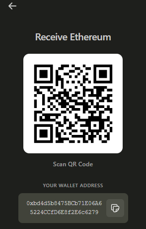

# VSWallet - Sepolia Testnet

<div style="display: flex; align-items: flex-start; gap: 20px;">
  <p align="center">
  
  
  
</p>
  <div style="flex: 1;">

## Overview

VSWallet is a lightweight, self-custodial Ethereum wallet extension for Visual Studio Code designed for testing and development on the Sepolia testnet. Test your dApps and smart contracts safely without risking real funds.

## ⚠️ Important Notice ⚠️

- **Testnet Only**: This wallet works exclusively with Sepolia testnet ETH (SepoliaETH/SEP)
- **No Real Value**: Sepolia ETH has no monetary value and cannot be exchanged for real ETH
- **Development Tool**: Designed for developers testing blockchain applications
- **Not for Production**: Do not use this wallet for mainnet or real transactions

  </div>
</div>

## Features

- **Secure Wallet Management** - Create new test wallets or import existing ones using seed phrases
- **Send & Receive Sepolia ETH** - Test transaction flows with zero risk
- **Real-time Price Tracking** - Monitor ETH price movements with testnet balance display
- **Transaction History** - View all your test transactions with detailed information
- **Multi-Wallet Support** - Switch between multiple test wallets seamlessly
- **Native VS Code UI** - Seamless integration with VS Code's sidebar

## Getting Test ETH

Sepolia ETH is free and can be obtained from faucets:

- [Alchemy Sepolia Faucet](https://sepoliafaucet.com/)
- [Infura Sepolia Faucet](https://www.infura.io/faucet/sepolia)
- [Chainlink Sepolia Faucet](https://faucets.chain.link/sepolia)

## Installation

### From Source

1. Clone the repository:
```bash
git clone https://github.com/yourusername/vswallet.git
cd vswallet
```

2. Install dependencies:
```bash
npm install
```

3. Install webview dependencies:
```bash
cd src/webview-ui/vswallet
npm install
cd ../../..
```

4. Build the extension:
```bash
npm run build:webview
npm run compile
```

5. Open the project in VS Code and press `F5` to launch in development mode

### From Extension Marketplace

*coming soon...*

## Usage

### Creating a Test Wallet

1. Open VSWallet from the VS Code sidebar
2. Click the menu button in the top-left
3. Select "New Wallet"
4. Save your seed phrase securely (even for test wallets)
5. Get free Sepolia ETH from a faucet

### Importing an Existing Test Wallet

1. Open VSWallet sidebar
2. Click menu and select "Connect Existing Wallet"
3. Enter your 12 or 24-word seed phrase
4. Your test wallet will be imported

### Testing Transactions

1. Click "Send" on the home screen
2. Enter recipient address (can be another test wallet)
3. Enter amount in Sepolia ETH
4. Add optional note
5. Review gas fees and confirm
6. Test transaction will appear in history

### Managing Test Data

1. Access transaction history from the menu
2. View all test transactions with status
3. Clear all data via Command Palette: "VSWallet: Clear All Data"

## Architecture

### Tech Stack

- Frontend: Svelte + TypeScript
- Backend: VS Code Extension API
- Blockchain: Ethers.js v6 (Sepolia Testnet)
- Storage: VS Code SecretStorage API (encrypted)
- Network: Sepolia Testnet Only

### Project Structure
```
vswallet/
├── src/
│   ├── extension.ts          # Extension entry point
│   ├── sidebar.ts             # Sidebar provider
│   ├── ethers/
│   │   └── walletService.ts   # Blockchain interaction
│   └── webview-ui/vswallet/src
│       ├── App.svelte
│       ├── ChangeWalletScreen.svelte
│       ├── ConnectWalletScreen.svelte
│       ├── HomeScreen.svelte
│       ├── NewWalletScreen.svelte
│       ├── TransactSendScreen.svelte
│       ├── TransactRecieveScreen.svelte
│       ├── TransactHistory.svelte
│       ├── walletService.ts
│       └── walletStore.ts
└── package.json
```

## Security (Even for Test Wallets)

### Security Features

- Encrypted storage using VS Code's SecretStorage API
- Local-only data - no external servers
- Direct blockchain interaction via RPC
- Transaction confirmation required before sending

### Best Practices

1. Treat test seed phrases with care (good practice)
2. Backup seed phrases even for test wallets
3. Never use test wallets for real funds
4. Keep separate wallets for testnet vs mainnet
5. Verify addresses before testing transactions

## Testing Scenarios

### Recommended Testing

- Send transactions between test wallets
- Test insufficient balance scenarios
- Verify transaction confirmation flows
- Test wallet import/export functionality
- Simulate gas price variations
- Test multi-wallet switching

### Not Supported

- ❌ Mainnet Ethereum
- ❌ Real ETH transactions  
- ❌ ERC-20 tokens (currently)
- ❌ Other networks (Polygon, BSC, etc.)

## Roadmap

### Current (v1.0.0) - Testnet

- ✅ Wallet creation and import
- ✅ Send/Receive Sepolia ETH
- ✅ Transaction history
- ✅ Multi-wallet support
- ✅ Price tracking

### Future Plans

- ERC-20 token support on testnet
- Multiple testnet support (Goerli, Mumbai, etc.)
- Advanced gas controls
- Transaction export (CSV)
- Test contract interaction

**Note**: Mainnet support is not planned. This tool is specifically designed for safe testing.

## Contributing

Contributions are welcome! This is a testnet-focused development tool.

1. Fork the repository
2. Create a feature branch (`git checkout -b feature/feature-name`)
3. Commit your changes (`git commit -m 'Add feature'`)
4. Push to branch (`git push origin feature/feature-name`)
5. Open a Pull Request

## Disclaimer

This software is provided for testing and development purposes only. Sepolia testnet ETH has no real-world value. The developers are not responsible for any misuse or misconfiguration. Always test thoroughly before deploying to production environments.

## License

This project is licensed under the MIT License. See the LICENSE file for details.